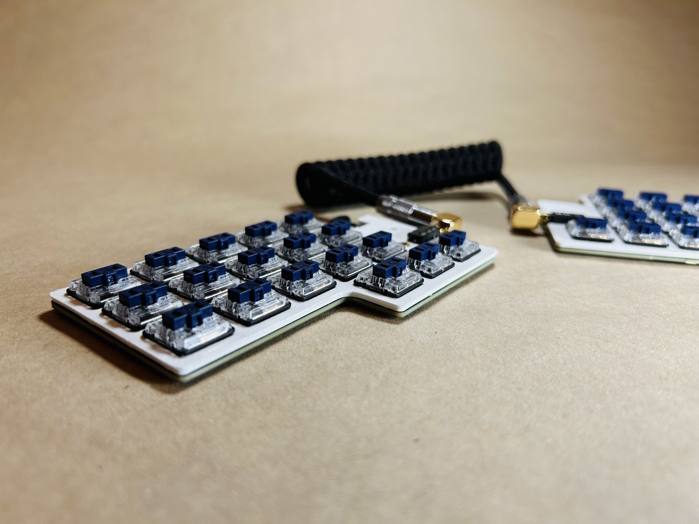
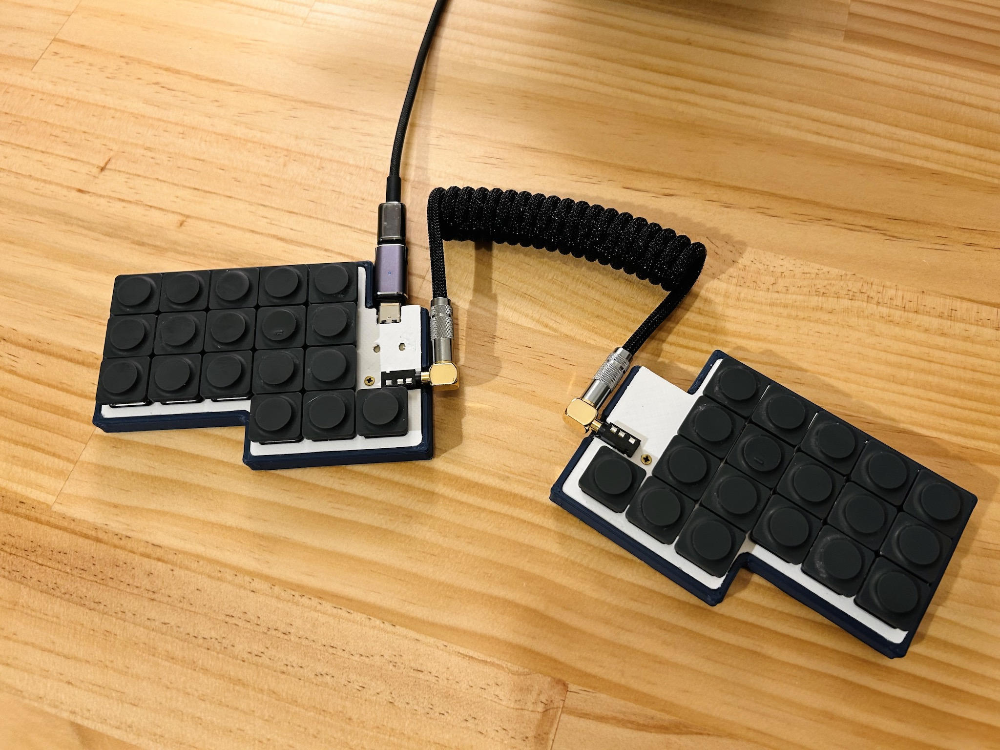
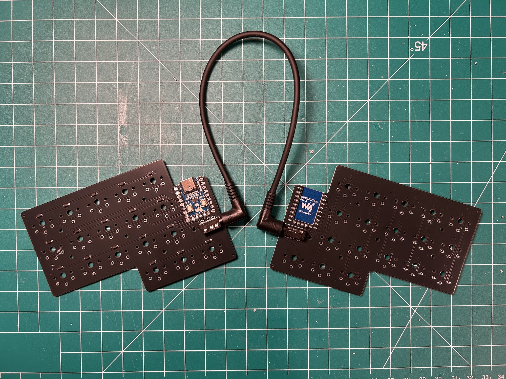
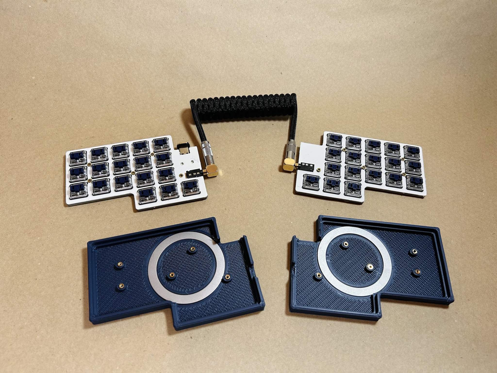

## EDC36 - Minimalist 36-Key Split Keyboard (Reversible PCB)

The EDC36 is a split keyboard designed with simplicity and portability in mind. 

## Bill of Materials (BOM)

Quantity | Item
--- | ---
1 | RP2040-Zero (left half)
1 | RP2040-Tiny (right half)
2 | EDC36 PCB
36 | Choc v1 (PG1350) switches and keycaps 
36 | 1N4148SOD-123 diodes
2 | Audio jack 4-poles (TRRS)
2 | EDC36 case & plate
10 | M2×3 heat-set threaded inserts
10 | M2×5 countersunk screws

## Production Files

To place an order for the EDC36 PCB:

- Use the Gerber files available in the [production/](production/) folder.
- Optionally, the [BOM](production/BOM.csv) and [CPL](production/CPL.csv) files can be utilized with a PCBA service. All diodes are soldered to the front (top) side of the board.

The complete PCB design project is available in the [kicad/](kicad/) folder.

## 3D Printable Files

Print the case and plate using the provided [STL files](case/).

## Firmware

Precompiled VIA-enabled firmware:

- Flash `penk_edc36_default.uf2` under [firmware/](firmware/) to the RP2040 MCUs.
- Load the [via.json](firmware/QMK/keyboards/edc36/via.json) file in `Design` tab for [VIA](https://usevia.app) configuration.

QMK source is available under [firmware/QMK/keyboards/edc36](firmware/QMK/keyboards/edc36).

## Copyright and License
Copyright (c) 2024 Penk Chen. All rights reserved.

All files are licensed under the MIT license. For more information, see the [LICENSE](LICENSE).
